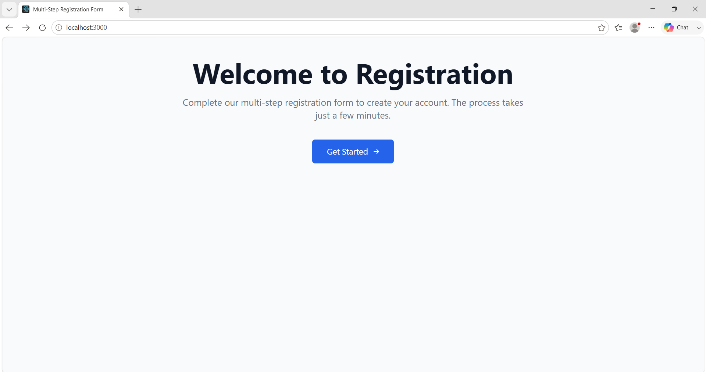
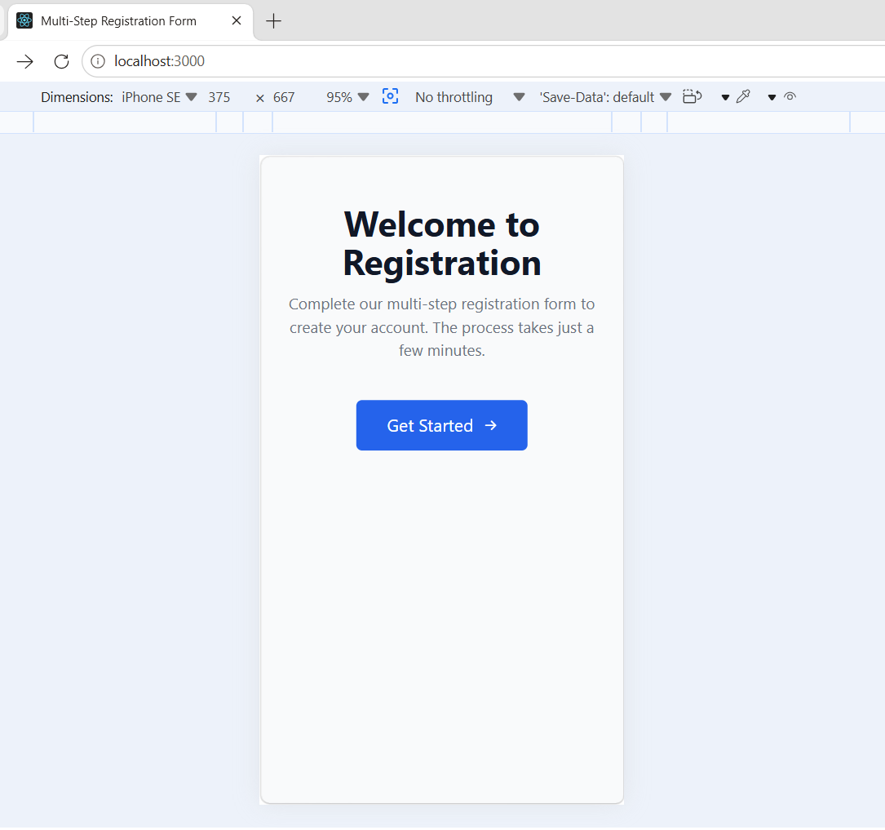

Here is the streamlined, copy-paste ready `README.md` file. The redundant details, deep-dive architecture notes, repetitive validation lists, and long documentation segments have been removed. What remains is a punchy, highly functional layout ready for production.

```markdown
# Multi-Step Registration Form

A production-ready, accessible, and responsive multi-step registration form built with React, TypeScript, and Tailwind CSS. Features real-time validation, centralized state management, and full accessibility compliance.


---

## ✨ Features

- **4-Step Workflow**: Personal Info → Address → Account Setup → Review.
- **Form Validation**: Real-time feedback, field-level validation on blur, and async username availability checks.
- **Accessibility (WCAG 2.1 AA)**: Keyboard navigation, `role="alert"` error announcements, and full screen-reader compliance.
- **State & Routing**: Efficient state management with Zustand and seamless navigation via React Router v6.
- **Containerization**: Production-ready Docker configuration powered by Nginx.

---

## 🛠 Tech Stack

- **Frontend**: React 18, TypeScript 4.9, Zustand, Tailwind CSS, React Router v6
- **Backend (Mock)**: json-server
- **Testing**: Jest, React Testing Library
- **DevOps**: Docker, Docker Compose, Nginx

---

### Screenshots

#### Desktop View


#### Mobile View

---
## 🚀 Getting Started

### Prerequisites
- **Node.js** (v18 or higher)
- **npm** or **yarn**
- **Docker** (Optional, for containerized setup)

### Installation

1. Clone the repository and navigate to the project directory:
   ```bash
   git clone [https://github.com/yourusername/multi-step-form.git](https://github.com/yourusername/multi-step-form.git)
   cd multi-step-form

```

2. Install the project dependencies:
```bash
npm install

```


3. Initialize your environment variables:
```bash
cp .env.example .env

```


---

## 🏃 Running the Application

### Local Development

1. Launch the Mock API in a separate terminal window:
```bash
npx json-server --watch db.json --port 3001

```


2. Start the local React development server:
```bash
npm start

```


*Your app will be available locally at `http://localhost:3000`.*

### Docker Deployment

To build and run both the frontend application and the mock API using Docker Compose:

```bash
docker-compose up --build

```

* **Frontend**: `http://localhost:3000`
* **Mock API**: `http://localhost:3001`

---

## 🧪 Testing

Execute the test suite or check code coverage statistics with the following scripts:

```bash
# Run all unit tests
npm test

# Run tests and generate coverage report
npm test -- --coverage

```

### Test Coverage Summary

| Module | Coverage |
| --- | --- |
| Validation Functions | 100% |
| Form Store | 95% |
| UI Components & Steps | 80%+ |
| **Overall** | **75%+** |

---

## 🔧 Environment Variables

Customize application behavior using your local `.env` file:

| Variable | Description | Default |
| --- | --- | --- |
| `REACT_APP_API_URL` | Mock API base URL endpoint | `http://localhost:3001` |
| `REACT_APP_TITLE` | Main application browser title | `Multi-Step Registration Form` |
| `REACT_APP_ENVIRONMENT` | Target deployment environment | `development` |
| `REACT_APP_ENABLE_ASYNC_VALIDATION` | Toggles async backend validation checks | `true` |

---

```

```